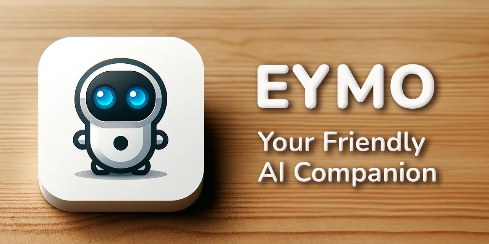

<p align="center">
  <a href="https://example.com/">
    <!--  -->
    
  </a>

  <h3 align="center">EYMO</h3>

  <p align="center">
    A compact robotic companion blending machine learning and generative AI to create personalized and interactive experiences.
    <br>
    <a href="https://github.com/xavi-burgos99/eymo/issues/new?template=bug.md">Report bug</a>
    ·
    <a href="https://github.com/xavi-burgos99/eymo/issues/new?template=feature.md&labels=feature">Request feature</a>
  </p>
</p>


## Table of contents

- [Table of contents](#table-of-contents)
  - [Video Demonstration](#video-demonstration)
- [Introduction](#introduction)
- [Features](#features)
- [Installation](#installation)
  - [Prerequisites](#prerequisites)
  - [Cloud](#cloud)
  - [Physic Robot](#physic-robot)
- [What's included](#whats-included)
- [Bugs and feature requests](#bugs-and-feature-requests)
- [Creators](#creators)
- [Acknowledgement](#acknowledgement)
- [References](#references)
- [License](#license)


## Introduction

Eymo is a compact robotic companion blending machine learning and generative AI to create personalized and interactive experiences. It learns from its interactions, offering customized conversations, entertainment, and learning opportunities. Eymo is the perfect blend of technology and companionship, making every moment more engaging and enjoyable.

### Video Demonstration
The video demonstration showcases EYMO's features and capabilities: [Video](https://www.youtube.com/watch?v=EVsdH6iUvgM)

## Features

* Voice Assistant: Eymo includes a voice assistant that leverages cloud technology for advanced speech recognition. This enables Eymo to understand and respond to a wide range of voice commands, making interactions smooth and intuitive.

* Mobile Control: Eymo can be controlled via dedicated mobile applications available for both Android and iOS. These apps provide a user-friendly interface to manage Eymo's functions, send commands, and receive updates, ensuring you stay connected with your robotic companion at all times.

* Obstacle Detection and Avoidance: Eymo is equipped with sensors that detect obstacles and prevent it from colliding with objects or falling off edges, such as tables. This feature ensures Eymo navigates safely and reliably in various environments.

### Mobile Apps
We have developed mobile applications to control the EYMO Robot from your smartphone. There are applications available for both major mobile operating systems:

* Android Application: Our Android app allows you to easily control the robot and send commands, as well as to share phone's location with the robot voice assistant. If you want to have access to the application, please contact the developers.
* iOS Application: Similarly, we have an iOS app for iPhone users, providing the same functionality for controlling the robot movement.

These applications enable seamless interaction with the robot, making it easy to operate and manage from anywhere.

## Installation

This section will guide you through the installation process of the EYMO project. The project is divided into two main parts: the cloud and the physic robot. 

The cloud part is responsible for the communication between the robot and the cloud, and the physic robot part is responsible for the robot's movements and sensors.

### Prerequisites
Before you begin, ensure you have the following installed on your system:
- Python 3.12 or higher

### Cloud
To set up the cloud part of the project, follow these steps:

1. Clone the repository and install the required packages:
   ```sh
   git clone https://github.com/xavi-burgos99/eymo.git
   cd eymo
   pip install -r requirements.txt
   ```
2. Run the cloud server on port 7125:
   ```sh
   uvicorn src.cloud.main:app --reload --port 7125
   ```
   If you want to run it using HTTPS, use this command instead:
    ```sh
    uvicorn src.cloud.main:app --reload --port 7125 --ssl-keyfile ./src/cloud/static/key_tst.pem  --ssl-certfile ./src/cloud/static/cert_tst.pem
    ```
3. The cloud server will be running on [http://localhost:7125/](http://localhost:7125/) or your server IP address.

### Physic Robot

1. Clone the repo and run the eymo.sh script to install all dependencies and prepare the Raspberry Pi for the robot:

```bash
cd eymo
./eymo.sh
```
The eymo.sh script will handle the installation of all necessary dependencies and set up your Raspberry Pi for the robot. Once the script completes, the robot will be ready to receive commands from the cloud and execute them. It will also be capable of sending information back to the cloud.

## What's included

Within the download you'll find the following directories and files, logically grouping common assets and providing both compiled and minified variations. You'll see something like this:

```text
src/
├── rpi/
│    ├── logs/
│    ├── models/ 
│    ├── services/
│    ├── static/
│    └── main.py     
├── arduino/
│   ├── MotorControlModule/
│   ├── ObstacleDetectionModule/
│   ├── ServoMovementModule/
│   ├── utilities.hpp
│   ├── arduino-eymo.h
│   └── arduino.ino
└── cloud/
    ├── actions/
    │   ├── gemini/
    │   ├── test/
    │   ├──BaseAction.py
    │   └── ...
    ├── externals/
    │   ├── TextToSpeech.py
    │   ├── BaseApi.py
    │   └── ...
    ├── routers/
    │   ├── model/
    │   ├── .env.template
    │   ├── Security.py
    │   └── ActionRouter.py
    ├── dependencies.py
    └── main.py 
LICENSE.md
README.md
```

## Bugs and feature requests

Have a bug or a feature request? Please, search for existing and closed issues. If your problem or idea is not addressed yet, [please open a new issue](https://github.com/xavi-burgos99/eymo/issues/new).

## Creators

1. **Xavier Burgos**
   - Website: <https://xburgos.es/>
   - GitHub: <https://github.com/xavi-burgos99/>
   - LinkedIn: <https://linkedin.com/in/xavi-burgos/>

2. **Yeray Cordero**
   - GitHub: <https://github.com/yeray142/>
   - LinkedIn: <https://linkedin.com/in/yeray142/>

3. **Javier Esmorris**
   - GitHub: <https://github.com/jaesmoris/>
   - LinkedIn: <https://www.linkedin.com/in/javier-esmoris-cerezuela-50840b253/>

4. **Gabriel Juan**
   - GitHub: <https://github.com/GabrielJuan349/>
   - LinkedIn: <https://linkedin.com/in/gabi-juan/>

5. **Samya Karzazi**
   - GitHub: <https://github.com/SamyaKarzaziElBachiri>
   - LinkedIn: <https://linkedin.com/in/samya-k-2ba678235/>


## Acknowledgement

This project has been made for the RLP (Robotics, Language and Planning) subject of the Computer Engineering degree at the [UAB (Universitat Autònoma de Barcelona)](https://www.uab.cat/). We would like to thank our professor [Fernando Vilariño](https://linkedin.com/in/fernandovilarino) for his support and guidance throughout the project.

The Cloud project was built for the MS (Multimedia Systems) subject in the Computer Engineering degree at [UAB (Universitat Autònoma de Barcelona)](https://www.uab.cat/). We want to express our gratitude to our professor [Jordi Serra](https://www.linkedin.com/in/jordiserraruiz/) for his assistance and support during this project in GCP (Google Cloud Platform).

## References

- [Vector Robot](https://ddlbots.com/products/vector-robot)
- [Cozmo Robot](https://grupoadd.es/el-pequeno-cozmo)
- [FastAPI](https://fastapi.tiangolo.com/)
- [Arduino](https://www.arduino.cc/)
- [Raspberry Pi](https://www.raspberrypi.org/)
- [Google Cloud Platform](https://cloud.google.com/)
- [TensorFlow Lite](https://www.tensorflow.org/lite)

## License

Code and documentation copyright 2024 EYMO. Code released under the [MIT License](https://reponame/blob/master/LICENSE).
